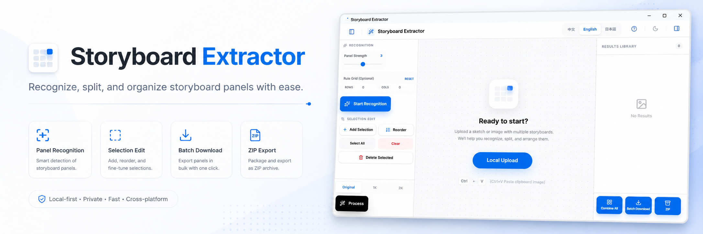

# Storyboard Extractor / ストーリーボード抽出ツール / 分镜提取器

## 简介 / Introduction / 紹介

**中文:**  
Storyboard Extractor 是一款简单易用的工具，专为本地处理故事板图片设计。支持中文、英文、日文三语切换，让用户可以轻松操作并识别、拆分、整理故事板内容。

**English:**  
Storyboard Extractor is a user-friendly tool designed for processing storyboard images locally. It supports multilingual switching (Chinese, English, Japanese) to make recognition, splitting, and organizing storyboards easy for users.

**日本語:**  
Storyboard Extractor は、ローカルでストーリーボード画像を処理するための簡単に使えるツールです。日本語・英語・中国語の三言語対応で、ユーザーがストーリーボードの認識、分割、整理を簡単に行えます。

---

## 使用 / How to Use / 使用方法

**中文:**  
解压项目后，直接打开目录[src-tauri\target\release]中的 [app.exe] 即可使用工具。

**English:**  
After decompressing the project, simply open the [app.exe] file located in the [src-tauri\target\release] directory to use the tool.

**日本語:**  
プロジェクトを解凍後、[src-tauri\target\release]ディレクトリ内の[app.exe]を直接開いて使用できます。

---

## 语言切换 / Language Switch / 言語切替

在应用界面右上角选择 **中文 / English / 日本語** 切换语言。  
Switch languages via the top-right corner of the application interface.  
アプリの右上で言語を切り替可能です。

---

## 注意事项 / Notes / 注意事項

**中文:**  
用户在使用本工具处理图像时，即表示同意本工具可以对上传的图像进行必要的处理以提供功能服务。本工具仅限用于合法用途，如处理个人作品或已获得授权的素材。用户必须保证上传的素材符合版权法律规定，并自行承担使用本工具处理任何受版权保护、违法或违规素材产生的后果。本工具及作者不对用户非法使用或对软件进行未经授权的修改和盗用行为承担任何责任。作者保留对软件及其生成内容进行合法追溯和保护的权利。

**English:**  
By using this tool to process images, the user consents to allow the tool to perform necessary operations on uploaded images to provide its functionality. This tool is intended solely for lawful purposes, such as processing personal work or legally authorized content. Users must ensure that uploaded content complies with copyright laws and are responsible for any consequences arising from processing copyrighted, illegal, or prohibited materials. The tool and its author are not liable for any unauthorized use, modification, or misappropriation of the software. The author reserves the right to legally trace and protect the software and its generated content.

**日本語:**  
ユーザーは、本ツールを使用して画像を処理することで、機能提供に必要な処理をツールが行うことを許可したものとみなされます。本ツールは、個人の作品や合法的に使用許諾された素材の処理など、合法的な目的のみに使用されます。ユーザーはアップロードする素材が著作権法に適合していることを保証し、著作権保護された素材や違法・禁止素材の処理による結果について自己責任を負うものとします。本ツールおよび作者は、ソフトウェアの無断使用、改変、盗用による問題に対して一切責任を負いません。作者は、ソフトウェアおよび生成されたコンテンツについて合法的な追跡と保護を行う権利を保持します。

---

## 注意事项 / Notes / 注意事項

- 本工具部分内容使用 AI 编程工具生成，可能存在部分问题，请谨慎使用。  
- The tool contains content generated with AI programming tools, some issues may exist. Use with caution.  
- 本ツールは AI プログラミングツールで生成された部分があり、問題が含まれる場合があります。注意してご使用ください。

- 如果该工具持续受到欢迎，作者将会持续更新和优化。  
- If this tool continues to be popular, the author will continue to update and improve it.  
- このツールが継続的に人気の場合、作者は更新と最適化を行う予定です。

---
